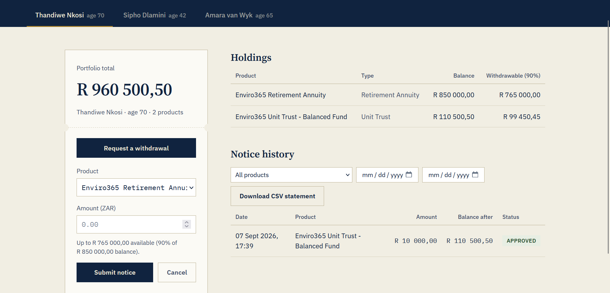
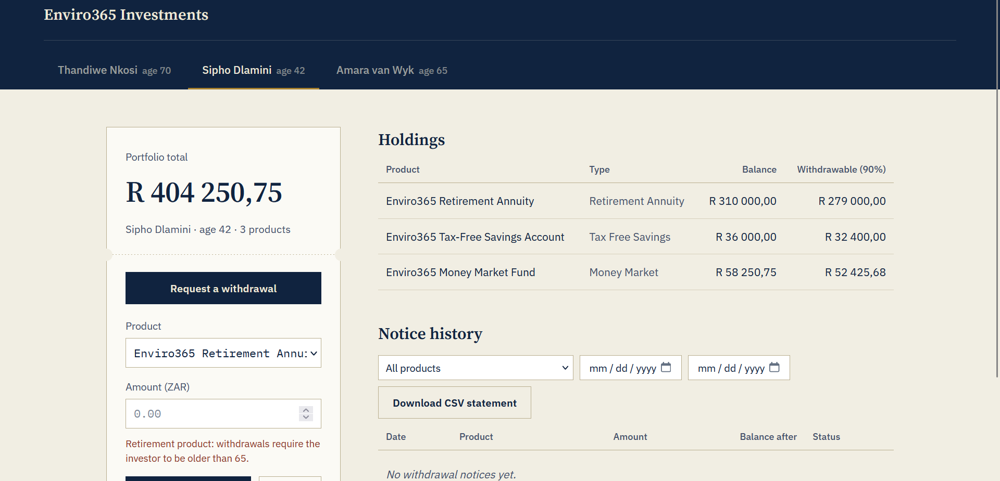
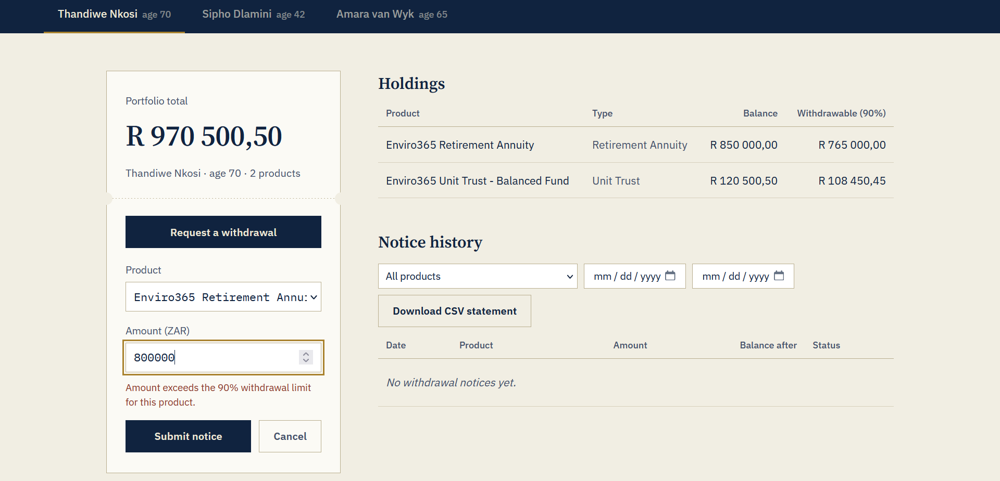
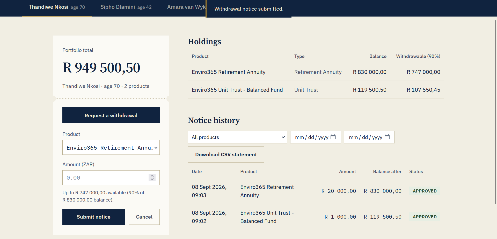
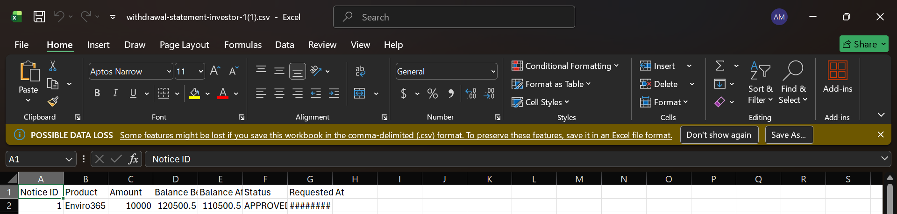

# Enviro365 Investments — Withdrawal Notice System

[](https://github.com/drico999/andries-enviro365-withdrawal-system/actions/workflows/ci.yml)

Junior Software Developer Assessment (eTalente, 2026) — a full-stack system that lets
Enviro365 investors view their portfolio, submit withdrawal notices against real-world
business rules, review their withdrawal history, and download a CSV statement.

> Package is `com.enviro.assessment.junior.andries`, as required by the brief.

## Stack

| Layer     | Technology                                            |
|-----------|--------------------------------------------------------|
| Backend   | Java 17, Spring Boot 3.3 (Web, Data JPA, Validation)   |
| Database  | H2 (in-memory)                                          |
| Frontend  | HTML / CSS / vanilla JavaScript (no build step)        |
| Tests     | JUnit 5 + Mockito + AssertJ                            |

No frontend framework was used deliberately — a plain HTML/CSS/JS UI keeps the focus on
the business logic and API integration the brief asks for, with zero build tooling
required to run it.

## Project structure

```
enviro365-withdrawal-system/
├── .github/workflows/         CI pipeline (backend build+test, frontend sanity checks)
├── backend/                  Spring Boot API
│   └── src/main/java/com/enviro/assessment/junior/andries/
│       ├── model/            JPA entities (Investor, Product, WithdrawalNotice, enums)
│       ├── repository/       Spring Data JPA repositories
│       ├── dto/               Request/response DTOs (entities never leave the service layer)
│       ├── service/           Business rules (WithdrawalService, InvestorService)
│       ├── controller/        REST controllers
│       ├── exception/         Custom exceptions + GlobalExceptionHandler
│       └── config/            CORS config + demo data seeder
└── frontend/                 Static single-page UI (index.html, styles.css, app.js)
└── screenshots/               UI screenshots referenced in this README
```

## Running it

### 1. Backend

Requires JDK 17+ and Maven (or use your IDE's built-in Maven/Spring Boot support).

```bash
cd backend
mvn spring-boot:run
```

The API starts on **http://localhost:8080**. Demo investors and products are seeded
automatically on every startup (H2 is in-memory, so data resets each run) — see
[Demo data](#demo-data) below. The H2 console is available at
`http://localhost:8080/h2-console` (JDBC URL: `jdbc:h2:mem:enviro365db`, user `sa`, no
password) if you want to inspect the schema directly.

To run the unit tests:

```bash
mvn test
```

## CI

Every push and pull request to `main` runs [`.github/workflows/ci.yml`](./.github/workflows/ci.yml)
via GitHub Actions:

- **Backend job** — sets up JDK 17, then runs `mvn clean verify` inside `backend/`, which
  compiles the project and runs the full `WithdrawalServiceTest` suite. Test reports are
  uploaded as a build artifact so failures can be inspected without re-running locally.
- **Frontend job** — since the frontend has no build step, this job just runs a Node
  syntax check on `app.js` (`node --check`) and confirms `index.html`, `styles.css`, and
  `app.js` are all present, catching obvious breakage before it reaches `main`.

Both jobs must pass before a PR is considered mergeable.

### 2. Frontend

The frontend is a static site with no build step. Simplest option — open
`frontend/index.html` directly in a browser, or serve it locally:

```bash
cd frontend
python3 -m http.server 5500
# then visit http://localhost:5500
```

It calls the API at `http://localhost:8080/api` (see the `API_BASE` constant at the top
of `app.js` if your backend runs elsewhere). CORS is already opened up on the backend
for local development.

## Demo data

Seeded on startup, deliberately covering both sides of the retirement-age rule:

| Investor        | Age | Products                                                                 |
|------------------|-----|---------------------------------------------------------------------------|
| Thandiwe Nkosi   | 70  | Retirement Annuity (R850,000), Unit Trust (R120,500.50)                  |
| Sipho Dlamini    | 42  | Retirement Annuity (R310,000), Tax-Free Savings (R36,000), Money Market (R58,250.75) |
| Amara van Wyk    | 65  | Retirement Annuity (R640,000), Unit Trust (R95,000) — exactly on the age boundary |

Amara is 65 exactly, not "older than 65", so her retirement annuity withdrawals should
still be declined — a deliberate edge case for the rule as written.

## Business rules

Enforced in `WithdrawalService`, in one place, independent of the HTTP layer:

1. **Retirement withdrawals require age > 65.** Applies only to `RETIREMENT_ANNUITY`
   products; other product types have no age restriction.
2. **A withdrawal may never exceed the product's current balance.**
3. **A withdrawal may never exceed 90% of the product's current balance** — a buffer
   the business keeps against every product.

A rejected request never touches the database; an approved one atomically reduces the
product's balance and records a `WithdrawalNotice`.

## API reference

All responses are JSON. Errors use a consistent shape (see [Error format](#error-format)).

### `GET /api/investors`
List investors (id, name, age) — used to populate the investor switcher.

### `GET /api/investors/{id}/portfolio`
Investor details plus their products, including a pre-calculated `maxWithdrawable`
(90% of balance) per product.

```json
{
  "investorId": 1,
  "fullName": "Thandiwe Nkosi",
  "age": 70,
  "totalBalance": 970500.50,
  "products": [
    { "id": 1, "productName": "Enviro365 Retirement Annuity", "productType": "RETIREMENT_ANNUITY",
      "retirementProduct": true, "balance": 850000.00, "maxWithdrawable": 765000.00 }
  ]
}
```

### `POST /api/withdrawals`
Submit a withdrawal notice.

```json
{ "investorId": 1, "productId": 1, "amount": 5000.00 }
```

Returns `201 Created` with the notice on success, or a `422 Unprocessable Entity` /
`400 Bad Request` with details if a business rule or validation fails.

### `GET /api/withdrawals/investor/{investorId}?productId=`
Withdrawal history for an investor, optionally filtered by product, newest first.

### `GET /api/withdrawals/export?investorId=&productId=&startDate=&endDate=`
Downloads a CSV statement (`text/csv`), filterable by product and/or a requested-date
range (`YYYY-MM-DD`).

### Error format

```json
{
  "timestamp": "2026-09-05T10:15:00",
  "status": 422,
  "error": "Unprocessable Entity",
  "messages": ["Withdrawal declined: amount (R60,000.00) exceeds available balance (R50,000.00)."],
  "path": "/api/withdrawals"
}
```

## What satisfies the advanced requirements

The brief asked for at least three; this submission includes four:

- **Global exception handling** — `GlobalExceptionHandler` (`@RestControllerAdvice`)
  turns every business-rule exception, validation failure, and unexpected error into
  the consistent JSON shape above, instead of a stack trace or Spring's default error page.
- **DTO layer** — JPA entities never leave the service layer; every request/response
  crossing the API boundary goes through a purpose-built DTO.
- **Input validation** — Bean Validation annotations (`@NotNull`, `@DecimalMin`) on
  `WithdrawalRequestDTO`, enforced via `@Valid` in the controller.
- **Unit tests** — `WithdrawalServiceTest` covers all three business rules (both the
  decline and success paths) and the not-found case, with repositories mocked so the
  tests run without a database.
- **UI validation** (partial) — the withdrawal form uses HTML5 `required`/`min`
  constraints and shows the live 90% limit and age-restriction warning as the investor
  types, ahead of the authoritative server-side check.

## AI usage disclosure

This project was built with the assistance of Claude (Anthropic), as permitted by the
brief. Specifically:

- The overall project structure (layered backend: model → repository → service →
  controller, with a DTO boundary and centralised exception handling) was scaffolded
  with AI assistance.
- The three withdrawal business rules, their ordering, and their error messages were
  written with AI assistance and then reviewed line by line — see the code comments in
  `WithdrawalService` explaining the reasoning behind each rule and behind decisions
  such as computing age from `LocalDate` rather than storing a static age field.
  Ordering matters: retirement-age eligibility is checked first, since it determines
  whether a retirement withdrawal is possible at all before the amount is checked
  against the balance and the 90% cap.
- The frontend's visual design (the "ledger ticket" motif, navy/brass/paper palette,
  serif-for-totals + monospace-for-figures typography) was an AI-assisted design
  choice, made deliberately to avoid a generic admin-dashboard look while fitting the
  subject matter — a financial withdrawal notice.
- The unit tests were AI-assisted; each test's intent (which rule/edge case it proves)
  is documented in its name and the class-level Javadoc.

I'm ready to walk through and justify any part of this implementation — including the
package layer choices, the rounding behaviour (`HALF_UP` to 2 decimal places
throughout, since these are monetary amounts), and why the age check uses `Period`
rather than a stored age.

## Screenshots

**Portfolio dashboard** — investor selected, holdings and notice history loaded from the API.



**Withdrawal form — retirement age rule** — selecting a retirement product for an
investor aged 65 or under (Sipho Dlamini, 42) surfaces the age-restriction warning
before the form can be submitted.



**Withdrawal form — 90% limit rule** — entering an amount over the 90% withdrawal
cap (Thandiwe Nkosi's Retirement Annuity) surfaces the live limit warning.



**Withdrawal submitted + notice history** — a successful `POST /api/withdrawals`
confirmed by the toast, with the new notice reflected in the history table.



**CSV export opened in Excel** — the downloaded statement from
`GET /api/withdrawals/export`, showing the correct columns and figures.



## Deliberate design decisions worth discussing at interview

- **Balances are recalculated on the `Product` row itself**, not derived by summing
  withdrawal notices — this keeps a read of "current balance" O(1) and matches how a
  real ledger system would treat a running balance, at the cost of needing the update
  to happen inside the same transaction as the notice insert (`@Transactional` on
  `createWithdrawal`).
- **Declined withdrawals are never persisted.** `WithdrawalStatus.DECLINED` exists on
  the enum for future extensibility (e.g. a manual-review workflow) but nothing in the
  current flow writes it — a declined request is rejected at the API boundary with a
  `422` and nothing touches the database.
- **CSV export takes an optional date range** on top of the mandatory product filter,
  since "with filtering" was underspecified in the brief and a statement is normally
  requested for a period, not just a product.
